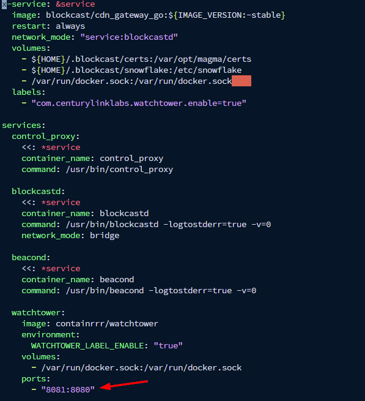

# Blockcast Beacon

Register Dashboard

Make sure to register your [Blockcast](https://app.blockcast.network/?referral-code=ESuQld) account first before getting started.

## Update System <a href="#install-dependencies" id="install-dependencies"></a>

```
sudo apt update && sudo apt upgrade -y
```

## Install Prerequisites & Docker

```
sudo apt install apt-transport-https ca-certificates curl software-properties-common -y && curl -fsSL https://download.docker.com/linux/ubuntu/gpg | sudo apt-key add - && sudo add-apt-repository "deb [arch=amd64] https://download.docker.com/linux/ubuntu focal stable" && sudo apt-get install docker-ce docker-ce-cli containerd.io docker-compose-plugin -y
```

## Verify Docker Installation <a href="#download-binary--copy-to-usrbin" id="download-binary--copy-to-usrbin"></a>

```
docker --version
```


You should see output like `Docker version 27.1.2, build d01f264`


## Install the Blockcast Beacon Docker

```
git clone https://github.com/Blockcast/beacon-docker-compose.git
cd beacon-docker-compose
```

## Run the Blockcast Beacon container

```
docker compose up -d
```


Before starting the node, ensure port 8080 is free. If it's in use, edit the configuration file using `nano docker-compose.yml` and change the port mapping from `8080:8080` to `8081:8080`


<div align="left"><figure><figcaption></figcaption></figure></div>

## Check Beacon containers

```
docker compose ps -a
```


Make sure all containers are running


<figure><figcaption></figcaption></figure>

## Locate your Node Location

```
curl -s https://ipinfo.io | jq '.city, .region, .country, .loc'
```

## **Generate Hardware ID and Challenge Key**

```
docker compose exec blockcastd blockcastd init
```

1. Copy the Registration URL from the terminal and paste it into your browser to open the Dashboard
2. Your Hardware ID and Challenge Key will be pre-filled. Enter your location from the previous command, then register your Node.

<figure><figcaption></figcaption></figure>


**Backup your private key** (in `~/.blockcast/certs/gw_challenge.key`) and keep it safe with the hardware ID, otherwise you will lose the ability to prove ownership of this device


<figure><figcaption></figcaption></figure>


You need to wait a few minutes before your node turns Online. The nodes need to be online for 6 hours in order for the first connectivity test to run. The first batch of rewards does not kick in until 24 hours of being continuously online.


<div data-full-width="true"><figure><figcaption><p>Happy Cuan Airdrop</p></figcaption></figure></div>


Join our Telegram group for the latest updates and discussions!

