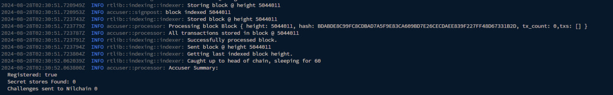

# 🖥️ Installation


Go to the [faucet](https://faucet.testnet.nillion.com/) to obtain NIL in your Keplr wallet


## Update System <a href="#install-dependencies" id="install-dependencies"></a>

```
sudo apt update && sudo apt upgrade -y
```

## Install Prerequisites & Docker

```
sudo apt install apt-transport-https ca-certificates curl software-properties-common -y && curl -fsSL https://download.docker.com/linux/ubuntu/gpg | sudo apt-key add - && sudo add-apt-repository "deb [arch=amd64] https://download.docker.com/linux/ubuntu focal stable" && sudo apt-get install docker-ce docker-ce-cli containerd.io docker-compose-plugin -y
```

## Verify Docker Installation <a href="#download-binary--copy-to-usrbin" id="download-binary--copy-to-usrbin"></a>

```
docker --version
```


You should see output like `Docker version 27.1.2, build d01f264`


## Download accuser Image

```
docker pull nillion/retailtoken-accuser:v1.0.0
```

## Create accuser directory

```
mkdir -p nillion/accuser
```

## Run the container to initialise accuser & register

```
docker run -v ./nillion/accuser:/var/tmp nillion/retailtoken-accuser:v1.0.0 initialise
```

This will output the details needed to register the accuser on the [website](https://verifier.nillion.com/verifier), connect your keplr wallet & register them below:

* accound\_id: Nillion address of the accuser
* public\_key: Public Key of the accuser


The accuser will save the credentials in a file named credentials.json within the created folder. It's important to back up this file if you lose it, you'll lose access to the keys and address of the accuser.


## Funding the accuser

To file accusations on Nilchain, you must first fund the accuser account with NIL. You can obtain this from the [Nillion faucet](https://faucet.testnet.nillion.com/)


The Nillion address of the accuser is the one that was generated and entered in the previous step (not your Keplr wallet address).


## Running the accuser


YOU MUST WAIT 30-60 MINUTES TO CONTINUE WITH THE STEPS BELOW


<figure><figcaption></figcaption></figure>

```
docker run -d -v ./nillion/accuser:/var/tmp nillion/retailtoken-accuser:v1.0.0 accuse --rpc-endpoint "https://testnet-nillion-rpc.lavenderfive.com/" --block-start 5096617
```


Adjust the `--block-start` value to the block height just before your registered verifier. To find this height, check the address you used to register your verifier on your connected Keplr wallet, then look up the transaction hash of type **"Pay For"** on the blockchain explorer to determine the block height where your verifier was registered


## Check verifier logs

```
# List Available Docker Container
docker ps

# Display logs
docker logs -f <container-id>
```

<figure><figcaption></figcaption></figure>


Wait until it synchronizes with the current block height. Once it does, you should see if the status shows "Registered" as true.


<div data-full-width="true"><figure><figcaption><p>Happy Cuan Airdrop</p></figcaption></figure></div>


Join our Telegram group for the latest updates and discussions!

